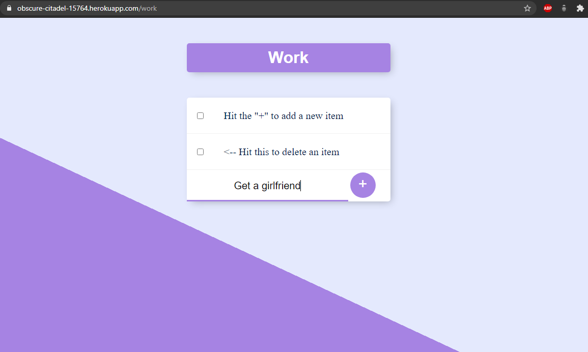

# ToDo List
#### Simple ToDo List for noting tasks for the day, and crossing them out when they are done, with different separate lists like "Home", "Work"... for organization.

## Technologies used:
- HTML
- CSS
- JavaScript
- Node.JS
- Express
- MongoDB
- Mongoose

## How to use

<li>In the search bar add "/list" to go to a list with that specific given name or if not existed, create one.</li>
<li>To add new items simply type the task inside "New Item" and click the plus button.</li>
<li>To delete one, click on the checkbox.</li>

### Details

The site is deployed with heroku and uses mongoDB Atlas for the database.
